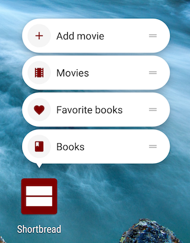

Shortbread
==========

Android library that generates [app shortcuts][1] for activities and methods annotated with `@Shortcut`.
No need to touch the manifest, create XML files or use the shortcut manager. Just annotate the code that
you want the shortcut to call.



The four shortcuts above are produced by the following code:

```java
@Shortcut(id = "movies", icon = R.drawable.ic_shortcut_movies, shortLabel = "Movies")
public class MoviesActivity extends Activity {

    // ...

    @Shortcut(id = "add_movie", icon = R.drawable.ic_shortcut_add, shortLabel = "Add movie")
    public void addMovie() {
        // code to add movie, could show an AddMovieDialogFragment for example
    }
}
```

```java
@Shortcut(id = "books", icon = R.drawable.ic_shortcut_books, shortLabel = "Books")
public class BooksActivity extends Activity {

    // ...

    @Shortcut(id = "favorite_books", icon = R.drawable.ic_shortcut_favorite, shortLabel = "Favorite books")
    public void showFavoriteBooks() {
        // code to display favorite books, could show a FavoriteBooksFragment for example
    }
}
```

To display the shortcuts, call `Shortbread.create(Context context)` as early as possible in the app, for
example in `onCreate` of a custom `Application`.

```java
public class App extends Application {

    @Override
    public void onCreate() {
        super.onCreate();

        Shortbread.create(this);
    }
}
```

Shortcuts can be customized with attributes, just like using the framework API.

```java
@Shortcut(
    id = "books",
    icon = R.drawable.ic_shortcut_books,
    shortLabel = "Books",
    shortLabelRes = R.string.shortcut_books_short_label,
    longLabel = "List of books",
    longLabelRes = R.string.shortcut_books_long_label,
    rank = 2, // order in list, relative to other shortcuts
    disabledMessage = "No books are available",
    disabledMessageRes = R.string.shortcut_books_disabled_message,
    enabled = true, // default
    backStack = {MainActivity.class, LibraryActivity.class},
    activity = MainActivity.class, // the launcher activity to which the shortcut should be attached
    action = "shortcut_books" // intent action to identify the shortcut from the launched activity
)
public class BooksActivity extends Activity { /*...*/ }
```
Download
--------

### Java

```groovy
dependencies {
    implementation 'com.github.matthiasrobbers:shortbread:1.1.0'
    annotationProcessor 'com.github.matthiasrobbers:shortbread-compiler:1.1.0'
}
```

### Kotlin

```groovy
apply plugin: 'kotlin-kapt'

dependencies {
    implementation 'com.github.matthiasrobbers:shortbread:1.1.0'
    kapt 'com.github.matthiasrobbers:shortbread-compiler:1.1.0'
}
```

License
-------

    Copyright 2017 Matthias Robbers

    Licensed under the Apache License, Version 2.0 (the "License");
    you may not use this file except in compliance with the License.
    You may obtain a copy of the License at

       http://www.apache.org/licenses/LICENSE-2.0

    Unless required by applicable law or agreed to in writing, software
    distributed under the License is distributed on an "AS IS" BASIS,
    WITHOUT WARRANTIES OR CONDITIONS OF ANY KIND, either express or implied.
    See the License for the specific language governing permissions and
    limitations under the License.


 [1]: https://developer.android.com/guide/topics/ui/shortcuts.html
